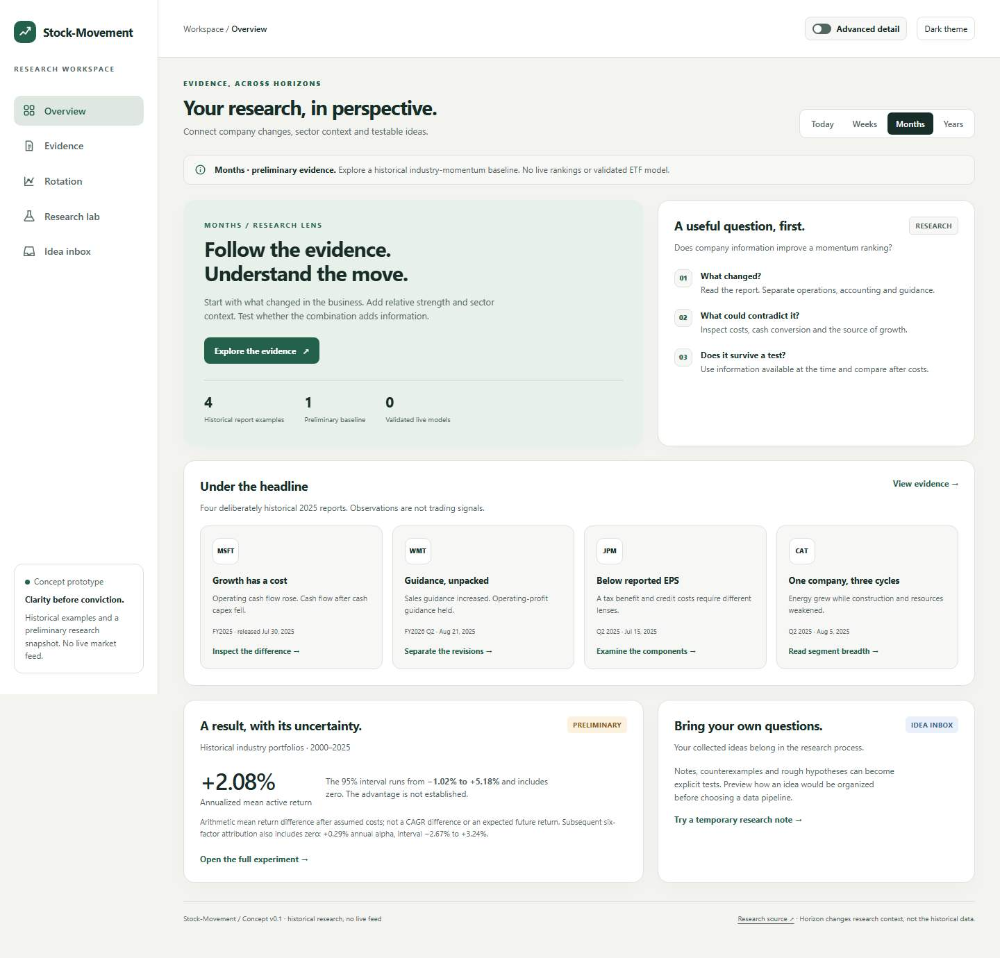
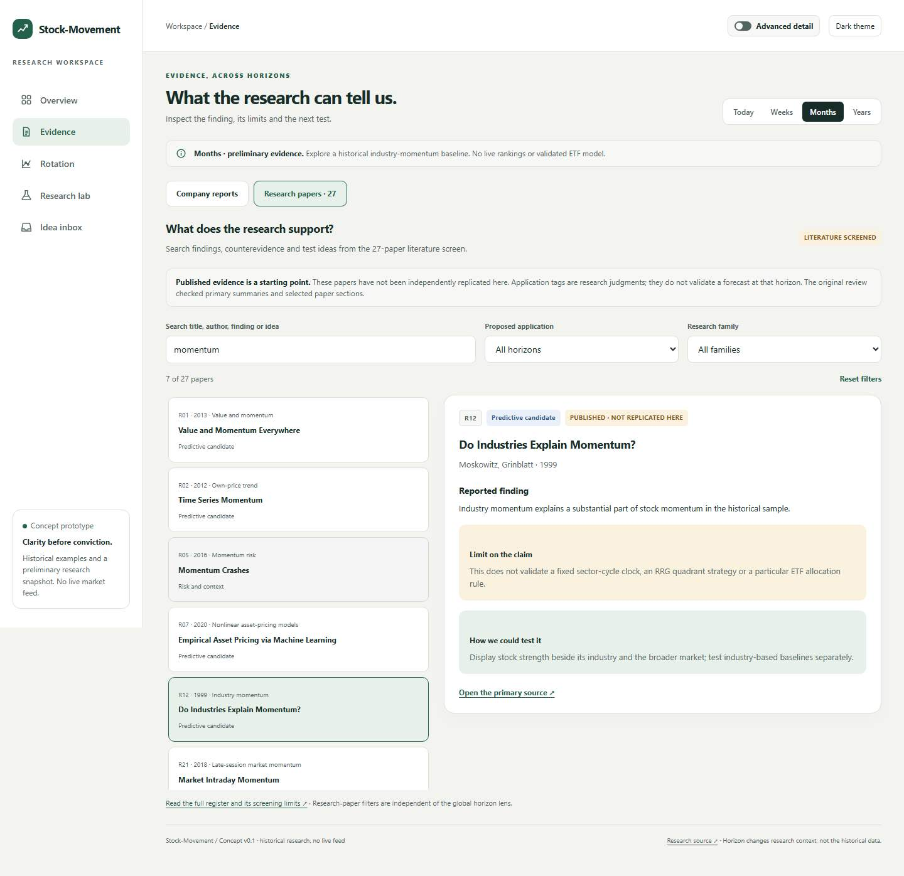

# Review the UI concept

[Download index.html](https://raw.githubusercontent.com/PaulBoyko1/Stock-Movement/codex/research-foundation/research/ui/index.html), save it as an HTML file, and open it in a browser. GitHub's file page shows source code; it does not run the interface. No installation or server is needed.

The concept contains five working views, Today/Weeks/Months/Years research context, simple/advanced detail, light/dark themes, four historical company reports, a searchable library of 27 screened papers, an illustrative sector map, and a temporary idea preview. It has no live data, forecast service, saved intake or trade execution.

Open **Evidence → Research papers** to search findings and test ideas, filter proposed applications, and inspect each claim's limitation and original screening scope. Lab now also exposes the unfinished data validation for the next ETF experiment.

[Design notes](design-notes.md) explain the intended product behavior and remaining decisions.

## Preview



[Sector rotation](previews/rotation-desktop.jpg) · [Research lab in dark mode](previews/lab-dark.jpg) · [Company evidence on mobile](previews/evidence-mobile.jpg)



[Paper library on mobile](previews/papers-mobile.jpg)

## Checks performed

The [successful browser run](https://github.com/PaulBoyko1/Stock-Movement/actions/runs/35422785098) used Chromium 140.0.7339.16 and Playwright 1.55.0 on code `1c5a4084d49b0652cbdd22f4d22d8f7c7d033482`. Its [machine-readable check record](checks.json) contains 91 named checks, with additional browser assertions for content and control states. Four catalog tests check source provenance, evidence-stage integrity, safe embedding and synchronization with the canonical JSON.

- Navigation, keyboard focus and skip link; all four horizons; simple/advanced switching; both themes.
- All four company fixtures/source links and sector selections.
- All 27 papers, search, intersecting filters, empty results, keyboard selection, source-link consistency, and switching back to company reports.
- Literal-text handling of HTML-looking inbox input, changed-note invalidation, clear, and reload reset.
- No document overflow at widths 320, 390, 768 and 1440 pixels, across every view with advanced mode both on and off.
- No JavaScript errors, external network requests or browser storage during the exercised flow.

The first prototype run caught a narrow-screen Lab overflow; card sizing and mobile wrapping were corrected. The current interface also passed a local Chromium 148.0.7778.96 / Playwright 1.60.0 run. Retained screenshots were captured locally from the exact HTML hash tested in CI; [the manifest](preview-manifest.json) records their hashes and capture environment. Eight selected text/status color pairs were previously checked against their unchanged CSS colors ([ratios](contrast-checks.json)); this is not a complete accessibility audit. Other browser engines, real devices and assistive technologies have not been tested.

Screenshots in this folder are retained with the repository. The Actions artifact (ID 10578760438) expires 2026-10-19T05:01:09Z.

To rerun locally:

```sh
python -m pip install playwright==1.55.0
python -m playwright install chromium
python research/ui/build_catalog.py --check
python -m unittest discover -s research/ui -p 'test_*.py' -v
python research/ui/verify_ui.py
```

Linux CI also installs Chromium's system dependencies. The script writes screenshots and checks to `work/ui/`; on a failed named check it retains diagnostic output. The statistical research suite is separate: [run instructions](../code/README.md).

After editing `research/evidence-catalog.json`, run `python research/ui/build_catalog.py` to refresh the embedded copy before testing. The downloaded HTML remains self-contained; it does not fetch the JSON at runtime.
