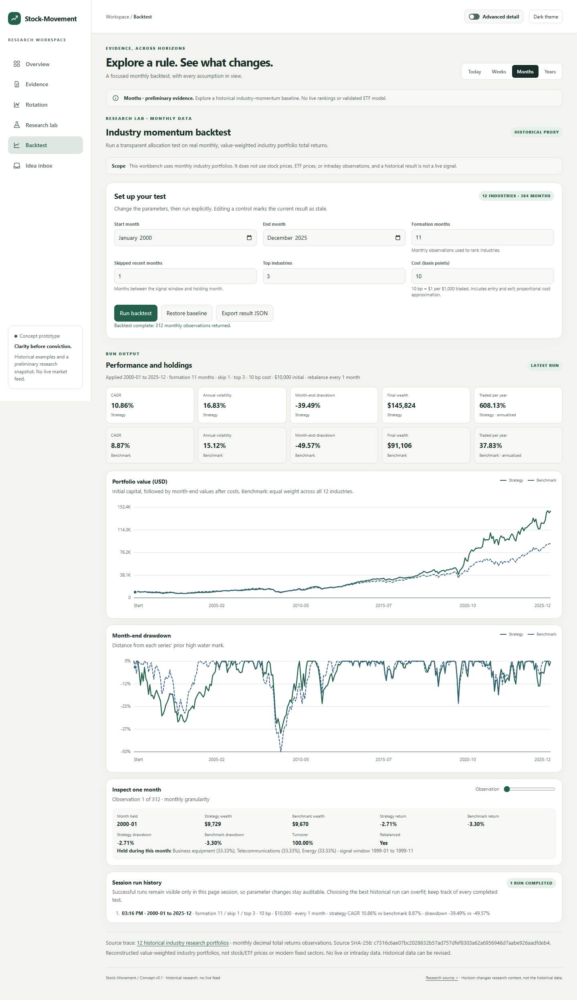

# Review the UI concept

[Download index.html](https://raw.githubusercontent.com/PaulBoyko1/Stock-Movement/codex/research-foundation/research/ui/index.html), save it as an HTML file, and open it in a browser. GitHub's file page shows source code; it does not run the interface. No installation or server is needed.

The concept contains six working views, Today/Weeks/Months/Years research context, simple/advanced detail, light/dark themes, four historical company reports, a searchable library of 27 screened papers, an illustrative sector map, a working monthly backtest, and a temporary idea preview. It has no live data, forecast service, saved intake or trade execution.

Open **Evidence → Research papers** to search findings and test ideas, filter proposed applications, and inspect each claim's limitation and original screening scope. Lab now also exposes the unfinished data validation for the next ETF experiment.

[Design notes](design-notes.md) explain the intended product behavior and remaining decisions.

## Try the backtest

Open **Backtest**, adjust the start/end dates, formation months, skipped recent months, number of industries and assumed costs, then choose **Run backtest**. The defaults use 2000–2025, 11 observed formation months, one skipped month, three holdings and 10 bp cost. **Restore baseline** resets the controls; run again to update the result.

Compare portfolio value and drawdown against an equally allocated 12-industry benchmark. Use **Inspect one month** to see returns, holdings, weights and the signal window; the slider also supports arrow keys. Changed inputs mark the last result stale and disable export. Invalid inputs produce an error without silently changing your settings. **Export result JSON** saves the current successful result, provenance and session run summaries. History disappears on refresh.

Advanced detail adds starting capital and a three-month rebalance option. This first instrument uses actual monthly French industry research portfolios, with data from 1994–2025 and earlier rows for formation history. It does not yet load stock/ETF price charts or intraday data. Every changed setting is exploratory. [Method and interpretation](backtest-workbench.md).

For a local server, run `python -m http.server 8766 --bind 127.0.0.1 --directory research/ui` from the repository root, then open [the Backtest view](http://127.0.0.1:8766/index.html#backtest).

## Preview


[Sector rotation](previews/rotation-desktop.jpg) · [Research lab in dark mode](previews/lab-dark.jpg) · [Company evidence on mobile](previews/evidence-mobile.jpg)


[Paper library on mobile](previews/papers-mobile.jpg)



[Backtest in dark mode](previews/backtest-dark.jpg) · [Backtest on mobile](previews/backtest-mobile.jpg)

## Checks performed

The [successful browser run](https://github.com/PaulBoyko1/Stock-Movement/actions/runs/35791314075) used Chromium 140.0.7339.16 and Playwright 1.55.0 on code `182e36a8a9d8a3920a676df54bc668864524a1ec`. Its [machine-readable check record](checks.json) contains 122 named checks, with additional browser assertions for content and control states. Four catalog tests check provenance and safe embedding. Ten calculation tests exercise timing, ties, portfolio drift, costs, metrics and invalid inputs. An independent JS/Python check compares all 312 monthly records and aggregate metrics at 0/10/25 bp to the frozen E04-P1 runner and committed results.

- Navigation, keyboard focus and skip link; all four horizons; simple/advanced switching; both themes.
- All four company fixtures/source links and sector selections.
- All 27 papers, search, intersecting filters, empty results, keyboard selection, source-link consistency, and switching back to company reports.
- Backtest defaults, changed parameters, date/skip/cost settings, advanced controls, keyboard month inspection, stale/error handling, exports, baseline restoration and session reset.
- Literal-text handling of HTML-looking inbox input, changed-note invalidation, clear, and reload reset.
- No document overflow at widths 320, 390, 768 and 1440 pixels, across every view with advanced mode both on and off.
- No JavaScript errors, external network requests or browser storage during the exercised flow.

The current interface also passed a local Chromium 148.0.7778.96 / Playwright 1.60.0 run. Retained screenshots were captured locally from the exact HTML hash tested in CI; [the manifest](preview-manifest.json) records their hashes and capture environment. Visual review corrected mobile source wrapping, chart labels, field sizing and button contrast. The run button exceeds 4.5:1 text contrast in both themes. Eight earlier text/status pairs are recorded separately ([ratios](contrast-checks.json)); this is not a complete accessibility audit. Other browser engines, real devices and assistive technologies have not been tested.

Screenshots in this folder are retained with the repository. The Actions artifact (ID 10722266165) expires 2026-10-22T22:15:52Z.

To rerun locally:

```sh
python -m pip install playwright==1.55.0
python -m playwright install chromium
python research/ui/build_catalog.py --check
python research/ui/build_workbench.py --check
python -m unittest discover -s research/ui -p 'test_*.py' -v
node --test research/ui/test_backtest_engine.cjs
python research/ui/verify_backtest_baseline.py
python research/ui/verify_ui.py
```

Linux CI also installs Chromium's system dependencies. The script writes screenshots and checks to `work/ui/`; on a failed named check it retains diagnostic output. The statistical research suite is separate: [run instructions](../code/README.md).

Node.js 18+ and Python 3.12 are sufficient; no Node packages are required. After editing `research/evidence-catalog.json`, run `python research/ui/build_catalog.py`. After editing the workbench HTML fragment, CSS, engine, controller or data, run `python research/ui/build_workbench.py`. Both builders preserve a self-contained offline HTML file. `prepare_backtest_data.py --input-zip PATH` can regenerate the panel from the exact frozen archive; it rejects a changed archive hash and keeps the raw ZIP in ignored `work/`.
